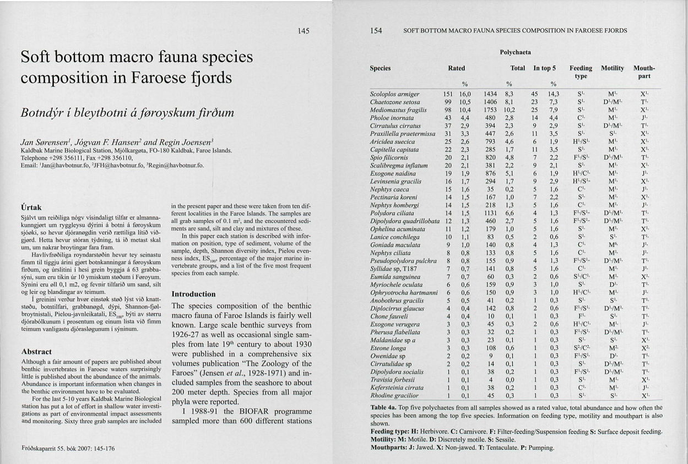

Segjum að einhvern langi til að skoða burstaorma úr mjúkum botni í færeyskum firði og rekist þar á orm sem er byggður eins og bambussproti. Viðkomandi hringir í vin sem segir að þetta sé pottþétt Maldanidae-ormur en til þess að vita hvaða tegund þetta sé þá þurfi að skoða haus eða afturenda betur. **Höskuldarviðvörun** þetta er ormurinn *Praxilella praetermissa* sem sést hér að neðan.


Þar sem flokkun smádýra er mjög vandasöm og tímafrek er ekki alltaf greint alla leið að tegund og ónákvæm greining látin duga. Stundum getur verið einfalt að sjá **ætt** (e. family) dýrsins undir smásjánni og þá getur verið gott að bera það saman við eintök af sem hafa fundist áður á svæðinu og eru sömu ættar. Maldanidae-ormar eru einmitt af því taginu að þeir eru mjög auðgreinanlegir sem ætt en svo vandast málið þegar á að tegundagreina þá nákvæmlega með greiningarlykli. 

| *Praxillella praetermissa* | |
|---|---|
| Ríki (Kingdom)  | Animalia |
| Fylking (Phylum)  | Annelida |
| Flokkur (Class)  | Polychaeta |
| Ættbálkur (Order)  | Capitellida |
| Ætt (Family)	  | Maldanidae |
|Undirætt (subfamily)| Euclymeninae |
| Ættkvísl (Genus)  | *Praxillella* |
| Tegund (Species)  | *Praxillella praetermissa* |


Segjum að spyrjandi finni lista af burstaormum frá Færeyjum í greininni [**Botndyr í bleytbotni á føroyskum firðum**](https://timarit.is/issue/324425) sem hann getur vonandi stuðst við.

{width=100%}

Það hjálpar óreyndum áhugamanni ekki mikið að sjá tegundirnar útlistaðar með þessum hætti þar sem tegundaheiti bera ekki með sér nema heiti **ættkvíslarinnar** (e. genus). Það er oftast ekkert í tegundaheiti ormanna sem gefur til kynna hærri flokkunarstig en ættkvísl. Flokkun Maldanidae-ormsins *Praxillella praetermissa* eins og hún er gefin upp á síðunni [Marine Species Identification Portal](http://species-identification.org/species.php?species_group=macrobenthos_polychaeta&id=189&menuentry=groepen) lítur svona út:


Á þessari síðu eru upplýsingar um einkenni sjávarlífvera og flokkun þeirra í flokkunarkerfi Linnaeusar. Langflestar tegundir sem ég hef rekist á í greiningum úr botnseti á grunnsævi hér við land eru tilgreindar á henni og þess vegna skrapaði ég öll flokkunarstigin þaðan með *for-lúppum* og R-pökkunum `httr` og `rvest`. Ekki verður því ferli lýst nákvæmlega hér en gögnin eru komin í .csv-skrána [Rank.csv](https://raw.githubusercontent.com/harkanatta/botndyr/main/skjol/species-identification/Rank.csv) :open_file_folder:. Í skránni eru flest dýr í bókinni **Macrobenthos of the North Sea** (M.J. de Kluijver et al.) og því hægt að fá hærri flokkunarstig þeirra tegunda sem finnast listum af því tagi sem birtist í Færeysku rannsókninni.

Þetta eru R-pakkarnir í þessu dæmi:

```
Rpakkar <- c("tidyverse", "dplyr", "data.table", "tabulizer", "DT")
pacman::p_load(Rpakkar, character.only = TRUE)

```
Byrjum á því að sækja [pfd-skjalið með töflunni](https://timarit.is/files/24875479) og lesa inn töfluna með R-pakkanum [tabulizer](https://github.com/ropensci/tabulizer) til þess að fá allan tegundalistann úr Færeysku rannsókninni.

```
f <- file.path("skjal.pdf")
tafla <- tabulizer::extract_tables(f)
tegundalisti = list(unlist(tafla)[2:40])
```

Þetta eru um 40 tegundir og tegundahópar. Óreyndur áhugamaður hefur, eins og áður sagði, enga vitneskju um hvaða tegundaheiti á að fletta upp ennþá. Til þess þarf hann að vita hvaða tegundir tilheyra Maldanidae ættinni. 

Þetta fall tekur inn lista af tegundum og tegundahópum og skilar töflu með hærri flokkunarstigum þeirra:

```
families <- function(tegundir){
#Pakkarnir:
  require(dplyr)
  require(data.table)
  require(tidyverse)
  require(DT)
  
#Hreinsa til í tegundalistanum. Taka burtu „white-space“ í kringum orðin, punkta, „sp“ og fleira.
  tegundir <- lapply(tegundir, function(x) trimws(x))
  tegundir <- sapply(tegundir, function(x) gsub("\\.|\\ sp|\\(p)|\\/.*","",x))
  tegundir <- tegundir[!is.na(tegundir) & tegundir != ""]
  tegundir <- as.list(tegundir)
  
#Lesa inn listann af Macrobenthos of the North Sea frá Marine Species Identification Portal:
  Rank <- read.csv("https://raw.githubusercontent.com/harkanatta/botndyr/main/skjol/species-identification/Rank.csv")

#Búa til tóma lista og data frames fyrir for-lúppuna:  
  DF <- data.frame()
  AList <- list()
  Annarlisti <- list()
  
#
  for (i in 1:length(tegundir)) {
    
    ifelse(
      lengths(strsplit(tegundir[[i]], "\\W+")) > 1,
      df2 <-
        Rank %>%
        mutate(ranks = case_when(
          tolower(Rank$Species) %like% tolower(tegundir[i]) == 1 ~ 'Species')),
      df2 <-
        Rank %>%
        mutate(ranks = case_when(
          tolower(Rank$Genus) %like% tolower(tegundir[i]) == 1 ~ 'Genus',
          tolower(Rank$Subfamily) %like% tolower(tegundir[i]) == 1 ~ 'Subfamily',
          tolower(Rank$Family) %like% tolower(tegundir[i]) == 1 ~ 'Family',
          tolower(Rank$Superfamily) %like% tolower(tegundir[i]) == 1 ~ 'Superfamily',
          tolower(Rank$Order) %like% tolower(tegundir[i]) == 1 ~ 'Order',
          tolower(Rank$Class) %like% tolower(tegundir[i]) == 1 ~ 'Class'
        )
        ))
    ifelse(all(is.na(df2$ranks)),
           Annarlisti[i] <- tegundir[i],NA)
    
    if (all(is.na(df2$ranks))){next}
    
    DF <- Rank[!is.na(df2$ranks),seq(1:match(unique(na.omit(df2$ranks)), colnames(Rank)))]
    AList[i] <- list(DF)
    
  }
  
  TheTable <- do.call(dplyr::bind_rows, AList)
  TheTable <- TheTable[!duplicated(TheTable), ]
  TheTable <- TheTable[c("Family","Genus","Species")] # Til styttingar, annars verður taflan of breið.
  DT::datatable(TheTable,caption = "Flokkun",rownames = F)
  
    
  #Til að sjá hvað er ekki tekið með (oft villur í nöfnum):
  #Ekki_i_toflu <- do.call(rbind,Annarlisti)
  #print(Ekki_i_toflu)
  
}

```
Þegar `families(tegundalisti)` er slegið inn ætti taflan hér að neðan að birtast með dálki fyrir ætt (e. family) framan við tegundaheitið. Taflan er gagnvirk og með því að slá inn *Maldanidae* (bambussprotaormurinn) koma upp þær tegundir sem tilheyra þeirri ætt. Þá þrengist leitin í tvo orma sem koma helst til greina.

```{r tafla, echo=FALSE, message=FALSE, warning=FALSE, cache=TRUE}
f <- file.path("C:/Users/valty/Documents/vinna/github/blogg/content/blogg/2021-12-21-flokkun-flokkunarkerfi-linnaeusar/skjal.pdf")
tafla <- tabulizer::extract_tables(f)
tegundalisti = list(unlist(tafla)[2:40])

families <- function(tegundir){
  require(dplyr)
  require(data.table)
  require(tidyverse)
  require(DT)
  
  tegundir <- lapply(tegundir, function(x) trimws(x))
  tegundir <- sapply(tegundir, function(x) gsub("\\.|\\ sp|\\(p)|\\/.*","",x))
  tegundir <- tegundir[!is.na(tegundir) & tegundir != ""]
  tegundir <- as.list(tegundir)
  
  Rank <- read.csv("https://raw.githubusercontent.com/harkanatta/botndyr/main/skjol/species-identification/Rank.csv")
  
  DF <- data.frame()
  AList <- list()
  Annarlisti <- list()
  
  for (i in 1:length(tegundir)) {
    
    ifelse(
      lengths(strsplit(tegundir[[i]], "\\W+")) > 1,
      df2 <-
        Rank %>%
        mutate(ranks = case_when(
          tolower(Rank$Species) %like% tolower(tegundir[i]) == 1 ~ 'Species')),
      df2 <-
        Rank %>%
        mutate(ranks = case_when(
          tolower(Rank$Genus) %like% tolower(tegundir[i]) == 1 ~ 'Genus',
          tolower(Rank$Subfamily) %like% tolower(tegundir[i]) == 1 ~ 'Subfamily',
          tolower(Rank$Family) %like% tolower(tegundir[i]) == 1 ~ 'Family',
          tolower(Rank$Superfamily) %like% tolower(tegundir[i]) == 1 ~ 'Superfamily',
          tolower(Rank$Order) %like% tolower(tegundir[i]) == 1 ~ 'Order',
          tolower(Rank$Class) %like% tolower(tegundir[i]) == 1 ~ 'Class'
        )
        ))
    ifelse(all(is.na(df2$ranks)),
           Annarlisti[i] <- tegundir[i],NA)
    
    if (all(is.na(df2$ranks))){next}
    
    DF <- Rank[!is.na(df2$ranks),seq(1:match(unique(na.omit(df2$ranks)), colnames(Rank)))]
    AList[i] <- list(DF)
    
  }
  
  TheTable <- do.call(dplyr::bind_rows, AList)
  TheTable <- TheTable[!duplicated(TheTable), ]
  TheTable <- TheTable[c("Family","Species")]
  DT::datatable(TheTable,caption = "Flokkun",rownames = F, colnames=c("Ætt", "Tegund"))
  
  #Til að sjá hvað er ekki tekið með (oft villur í nöfnum):
  #Ekki_i_toflu <- do.call(rbind,Annarlisti)
  #print(Ekki_i_toflu)
  
}

families(tegundalisti)

```


Neðst í *for-lúppunni* er annar listi (sem er kallaður `Annarlisti` og er tekinn út með millumerki) sem inniheldur þau heiti á Færeyska listanum sem ekki komust í töfluna. Þeim getur hafa verið sleppt vegna þess að taflan hjá mér er ófullkomin eða að það séu villur og athugasemdir í tegundaheitunum. Það má einfaldlega lagfæra með því að opna tegundalistan í ritli þegar maður hefur komist að því hvað þarf að laga.


```{r taflaB, echo=FALSE, message=FALSE, warning=FALSE, cache=TRUE}
ekkifamilies <- function(tegundir){
  require(dplyr)
  require(data.table)
  require(tidyverse)
  require(DT)
  
  tegundir <- lapply(tegundir, function(x) trimws(x))
  tegundir <- sapply(tegundir, function(x) gsub("\\.|\\ sp|\\(p)|\\/.*","",x))
  tegundir <- tegundir[!is.na(tegundir) & tegundir != ""]
  tegundir <- as.list(tegundir)
  
  Rank <- read.csv("https://raw.githubusercontent.com/harkanatta/botndyr/main/skjol/species-identification/Rank.csv")
  
  DF <- data.frame()
  AList <- list()
  Annarlisti <- list()
  
  for (i in 1:length(tegundir)) {
    
    ifelse(
      lengths(strsplit(tegundir[[i]], "\\W+")) > 1,
      df2 <-
        Rank %>%
        mutate(ranks = case_when(
          tolower(Rank$Species) %like% tolower(tegundir[i]) == 1 ~ 'Species')),
      df2 <-
        Rank %>%
        mutate(ranks = case_when(
          tolower(Rank$Genus) %like% tolower(tegundir[i]) == 1 ~ 'Genus',
          tolower(Rank$Subfamily) %like% tolower(tegundir[i]) == 1 ~ 'Subfamily',
          tolower(Rank$Family) %like% tolower(tegundir[i]) == 1 ~ 'Family',
          tolower(Rank$Superfamily) %like% tolower(tegundir[i]) == 1 ~ 'Superfamily',
          tolower(Rank$Order) %like% tolower(tegundir[i]) == 1 ~ 'Order',
          tolower(Rank$Class) %like% tolower(tegundir[i]) == 1 ~ 'Class'
        )
        ))
    ifelse(all(is.na(df2$ranks)),
           Annarlisti[i] <- tegundir[i],NA)
    
    if (all(is.na(df2$ranks))){next}
    
    DF <- Rank[!is.na(df2$ranks),seq(1:match(unique(na.omit(df2$ranks)), colnames(Rank)))]
    AList[i] <- list(DF)
    
  }
  
  TheTable <- do.call(dplyr::bind_rows, AList)
  TheTable <- TheTable[!duplicated(TheTable), ]
  TheTable <- TheTable[c("Family","Species")]
  #DT::datatable(TheTable,caption = "Flokkun",rownames = F)
  
  #Til að sjá hvað er ekki tekið með (oft villur í nöfnum):
  Ekki_i_toflu <- do.call(rbind,Annarlisti)
  print(Ekki_i_toflu)
  
}

ekkifamilies(tegundalisti)

```

Hér að ofan er listinn yfir þau heiti sem ekki komust gegnum nálaraugað. Það má sjá forskeytið „Di“ framan við *Polydora quadrillobata* og Syllidae er með „T187“ fyrir aftan. Þetta má kanna betur hvað þýðir. Auka bil er á milli **Tra** og **vista** í *Tra visia forbesii* en það verður að skrifa á innlesturinn í R-ið hjá mér.

